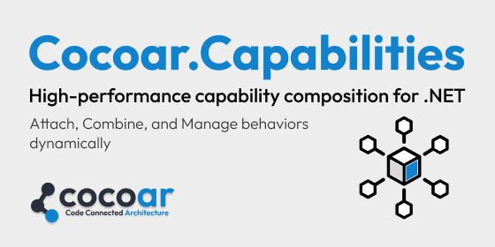

# High-performance capability composition for .NET


> A high-performance, low-allocation capability composition library for .NET that implements the Capability Composition pattern for building extensible, type-safe systems.

[](https://www.nuget.org/packages/Cocoar.Capabilities/)
[](LICENSE)
[](https://dotnet.microsoft.com/)
[](https://www.nuget.org/packages/Cocoar.Capabilities/)

## Installation

```bash
dotnet add package Cocoar.Capabilities
```

## Quick Start

```csharp
using Cocoar.Capabilities;

// Create a scope and compose capabilities onto a subject
var scope = new CapabilityScope();

scope.Compose("user-service")
    .Add(new LoggingCapability { Level = LogLevel.Debug })
    .Add(new RetryCapability { MaxAttempts = 3 })
    .Build();

// Query the composition
var composition = scope.Compositions.GetRequired<string>("user-service");
var logging = composition.GetFirstOrDefault<LoggingCapability>();
Console.WriteLine(composition.Has<LoggingCapability>()); // True
```

## Documentation

Full documentation with guides, API reference, and examples:

**[docs.cocoar.dev/capabilities](https://docs.cocoar.dev/capabilities/)**

- [Getting Started](https://docs.cocoar.dev/capabilities/guide/getting-started) — Install, compose, query
- [Why Capabilities?](https://docs.cocoar.dev/capabilities/guide/why-capabilities) — The problem this solves
- [API Reference](https://docs.cocoar.dev/capabilities/reference/api) — Complete method reference
- [Examples](https://docs.cocoar.dev/capabilities/reference/examples) — Real-world patterns

## Key Concepts

| Type | Role |
|------|------|
| `CapabilityScope` | Container that manages composers and compositions |
| `Composer` | Fluent builder for attaching capabilities to a subject |
| `IComposition` | Immutable, thread-safe result of a composition |
| `IPrimaryCapability` | Marker interface for the "identity" capability |
| `CapabilityScope<TOwner>` | Strongly-typed scope with immutable owner |

## Contributing & Versioning

- SemVer (additive MINOR, breaking MAJOR)
- PRs & issues welcome
- Licensed under Apache License 2.0 (explicit patent grant & attribution via NOTICE)

### License & Trademark
This project is licensed under the [Apache License, Version 2.0](LICENSE). See [`NOTICE`](NOTICE) for attribution.

"Cocoar" and related marks are trademarks of COCOAR e.U. Use of the name in forks or derivatives should preserve attribution and avoid implying official endorsement. See [TRADEMARKS](TRADEMARKS.md) for permitted and restricted uses.
