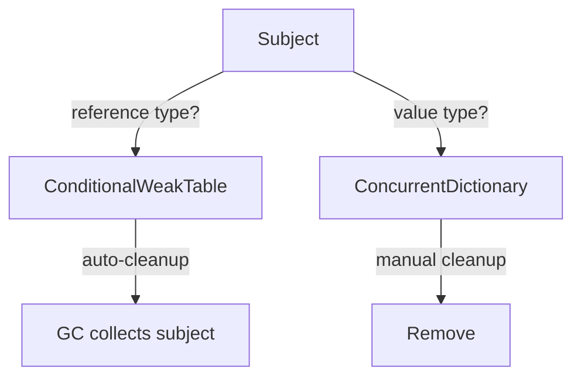

# Registries

`CapabilityScope` maintains two optional registries that cache composers and compositions for later retrieval.

## Two Registries

| Registry | Stores | Purpose |
|----------|--------|---------|
| `Composers` | `Composer` instances | Retrieve a builder after creation (e.g., for recomposition) |
| `Compositions` | `IComposition` results | Retrieve completed compositions by subject |

Both are enabled by default.

## Configuring Registries

```csharp
var scope = new CapabilityScope(new CapabilityScopeOptions
{
    UseComposerRegistry = true,     // default: true
    UseCompositionRegistry = true,  // default: true
});
```

## CompositionRegistryApi

```csharp
// Try-pattern
if (scope.Compositions.TryGet("my-subject", out var composition))
{
    var caps = composition.GetAll<ICapability>();
}

// Get or default (returns null)
var comp = scope.Compositions.GetOrDefault("my-subject");

// Get required (throws)
var comp = scope.Compositions.GetRequired("my-subject");

// Generic overloads
var comp = scope.Compositions.GetRequired<string>("my-subject");

// Remove
scope.Compositions.Remove("my-subject");
```

## ComposerRegistryApi

```csharp
// Try-pattern
if (scope.Composers.TryGet("my-subject", out var composer))
{
    // Composer still available
}

// Get or default
var c = scope.Composers.GetOrDefault("my-subject");

// Get required (throws)
var c = scope.Composers.GetRequired("my-subject");

// Register manually
scope.Composers.Register("key", composer, forceRegister: false);

// Remove
scope.Composers.Remove("my-subject");
```

## Per-Operation Override

Override the default registry behavior for individual operations:

```csharp
// Compose but don't register the composer
var composer = scope.Compose("temp-subject", useRegistry: false);

// Build but don't register the composition
var composition = composer.Build(useRegistry: false);
```

## Reference Types vs Value Types

Registry storage differs by subject type:

| Subject Type | Storage | Lifetime | Cleanup |
|-------------|---------|----------|---------|
| Reference types (classes) | `ConditionalWeakTable` | Weak — GC cleans up | Automatic when subject is collected |
| Value types (structs, enums) | `ConcurrentDictionary` | Strong — persists | Manual via `Remove()` |

::: warning
Value-type subjects (e.g., enums, structs) persist in the registry for the scope's lifetime. If you register many value-type subjects dynamically, call `Remove()` when they're no longer needed.
:::



## Registry Decision Matrix

| Scenario | Composer Registry | Composition Registry |
|----------|-------------------|---------------------|
| Standard usage | On | On |
| Fire-and-forget compositions | Off | On |
| Temporary compositions | Off | Off |
| Need to recompose later | On | On |
