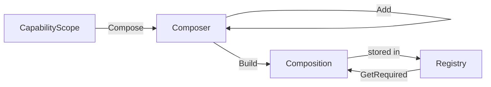

# CapabilityScope

## What Is a Scope?

A `CapabilityScope` is the container that manages all capability compositions. It holds two registries (composers and compositions) and provides the entry points for composing and querying capabilities.

## Creating a Scope

```csharp
// Default — both registries enabled
var scope = new CapabilityScope();

// With options
var scope = new CapabilityScope(new CapabilityScopeOptions
{
    UseComposerRegistry = false,
    UseCompositionRegistry = true
});
```

## Composing Capabilities

`Compose()` creates a `Composer` for a given subject:

```csharp
var composer = scope.Compose("my-subject");
composer.Add(new SomeCapability()).Build();
```

This registers the subject in the composer registry (if enabled), then `Build()` stores the resulting composition in the composition registry.

## Recomposing

Use `Recompose()` to create a new composition based on an existing one:

```csharp
var existing = scope.Compositions.GetRequired<string>("my-subject");
scope.Recompose(existing)
    .Add(new AnotherCapability())
    .Build();
```

The new composition replaces the old one in the registry.

## Context Isolation

Different scopes are completely independent worlds:

```csharp
var scopeA = new CapabilityScope();
var scopeB = new CapabilityScope();

scopeA.Compose("user").Add(new CapA()).Build();
scopeB.Compose("user").Add(new CapB()).Build();

// scopeA only has CapA for "user"
// scopeB only has CapB for "user"
```

## Scope Lifetime

Scopes are typically long-lived — created once and shared. Common patterns:
- **Application-wide**: One scope for the entire app
- **Per-tenant**: Isolated scope per tenant
- **Per-test**: Fresh scope per test for isolation

`CapabilityScope` implements `IDisposable` to clean up registry resources.

## Properties

| Property | Type | Description |
|----------|------|-------------|
| `Composers` | `ComposerRegistryApi` | Access the composer registry |
| `Compositions` | `CompositionRegistryApi` | Access the composition registry |
| `Owner` | `ScopeOwnerApi` | Associate a single owner with the scope |
| `Anchors` | `ScopeAnchorsApi` | Associate typed or named anchors with the scope |

## Scope Flow


